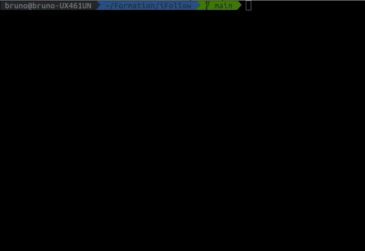

[![LinkedIn][linkedin-shield]](https://www.linkedin.com/in/bindrigo/)
 
<!-- TABLE OF CONTENTS -->
<details open="open">
 <summary><h2 style="display: inline-block">Table of Contents</h2></summary>
 <ol>
   <li>
     <a href="#alarms-sequence">Alarms sequence</a>
     <ul>
       <li><a href="#development-tools">Development Tools</a></li>
     </ul>
   </li>
   <li>
     <a href="#installation">Installation</a>
     <ul>
       <li><a href="#prerequisites">Prerequisites</a></li>
       <li><a href="#compilation">Compilation</a></li>
       <li><a href="#usage">Usage</a></li>
     </ul>
   </li>
   <li><a href="#typical-scenario">Typical scenario</a></li>
   <li><a href="#limitations-and-improvements">Limitations and improvements</a></li>
 </ol>
</details>
 
 
 
## Alarms sequence
 
This project presents an API to visualize alarm audio sequences on the command line.
 
The base time unit is `250ms` which means that a character (`_` or `X`) is printed at this time interval on the screen. The different aspects of each alarm configuration are:
 
* `beep period` ->  time elapsed between beeps of the alarm;
* `beep duration` -> interval during which the alarm prints **X**;
* `beep repetition` -> how many times the alarm will beep before `pause duration`;
* `pause duration` -> waiting time before another cycle of beeps.

### Architecture

#### Classes
We have two classes to implement this alarm API:
* [Alarm](alarm.hpp) -> base functionalities of an alarm (activate, deactivate, start, stop, etc). It's also responsible for the creation of the thread which works on the `beepTask()` method
* [AlarmManager](alarmManager.hpp) -> used to manage alarm priorities. It keeps a reference for each alarm inside a vector and it takes the decisions on which alarm starts or stops from `triggerAlarm`.

#### Main function

The [main](main.cpp) function used here to demonstrate the API works as follows:

* Create 3 alarms with different priorities (Low, Medium and High)
* Add them to `AlarmManager`
* Wait inside loop for the keyboard input

The output is shown on [Typical Scenario](#typical-scenario) section. 
 
### Development Tools
 
* [CMake](https://cmake.org/) 3.14+
* [Gtest](https://google.github.io/googletest/)
 
## Installation
### Prerequisites
 
Tested on Ubuntu 20.04
 
* Cmake
 ```sh
 sudo apt install cmake
 ```
* Gtest
 ```sh
 sudo apt-get install libgtest-dev
 ```
 
### Compilation
 
1. Clone the repo
  ```sh
  git clone git@github.com:bruinsan/iFollow.git
  ```
2. From the directory `iFollow` compile and build the project
  ```sh
  cmake . -Bbuild/
  cmake --build build
  ```
 
### Usage
 
After building the project, we have 2 binary files (for the main application and the tests). 

To run the application, we do:
```sh
./build/alarm_sample
```
 
To run the tests:
 
```sh
./build/tests/test_alarm
```
 
## Typical scenario
 
The GIF below shows a scenario of activation / deactivation of `three` alarms with different priorities for the triggering **(Low, Medium** and **High)**.
 
The order of events on this demonstration follows:
 
* No alarm is started, printing (`_`)
* Pressing **(l)**, `Low` alarm starts, printing 5 times (`X`) after 30 seconds
* Pressing **(m)**, `Medium` alarm starts, pausing `Low` and printing (`X`) every 1 second
* Pressing **(h)**, `High` alarm starts, pausing `Medium` and printing (`X`) 5 times at the interval of 500 milliseconds and pausing for 2 seconds before restarting
 
---
 
* Pressing **(h)** again makes `High` stop, immediately restarting `Medium`
* Pressing **(m)** again makes `Medium` stop, immediately restarting `Low`
* Pressing **(l)** again makes `Low` stop
 
---
 
* Pressing **(h)** again will restart `High`
* Pressing **(s)** will stop and deactivate all alarms
* Pressing **(Q)** ends the application
 

 
## Limitations and improvements
 
The current implementation (V3.0) of the project still has some identified issues to be fixed:
 
* When adding alarms to `AlarmManager` the priority order must be respected, otherwise the mechanism to restart the alarms won't work properly.
 
* `AlarmManager` class has a vector of pointers to `Alarm` and in order to avoid memory leaks and a better management of the alarm life cycle, we can use smart pointers
 
[linkedin-shield]: https://img.shields.io/badge/-LinkedIn-black.svg?style=for-the-badge&logo=linkedin&colorB=555
[linkedin-url]: https://linkedin.com/in/github_username

